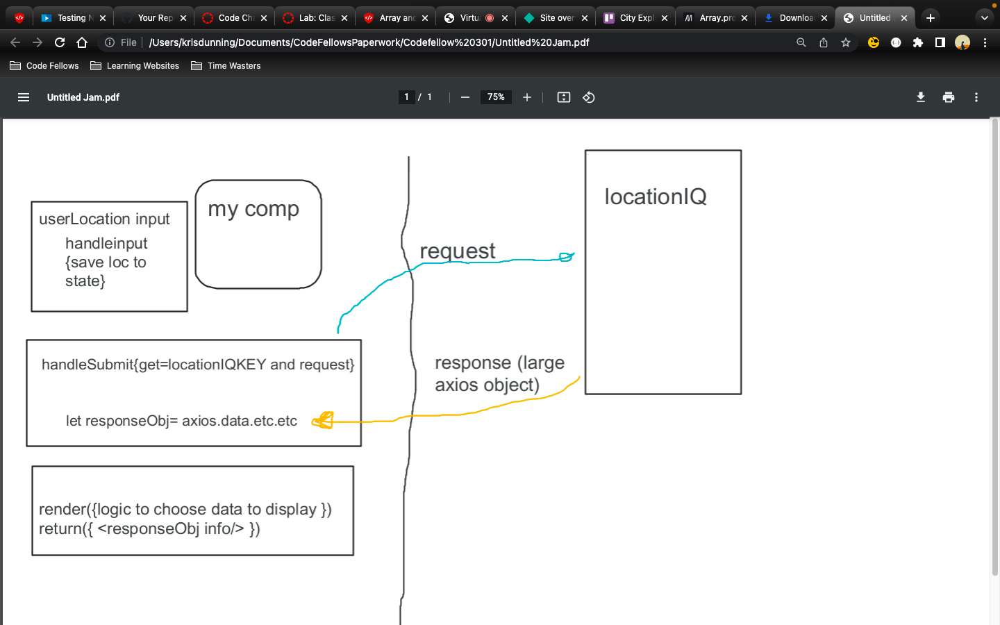
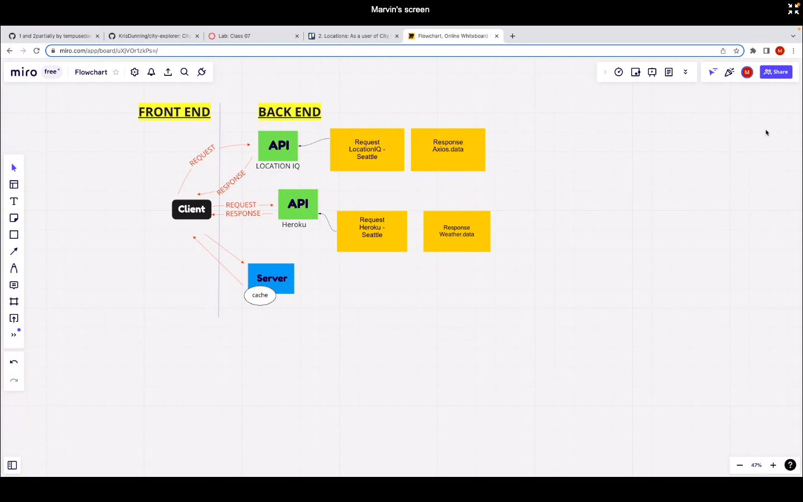
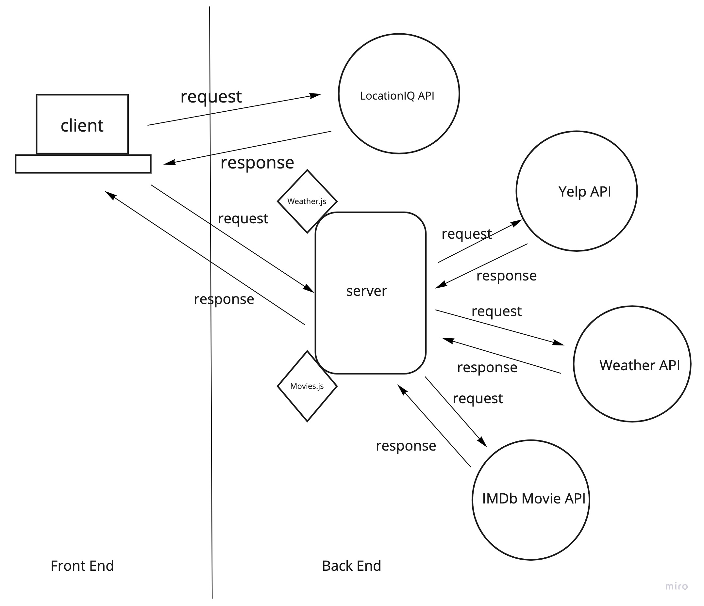

# City Explorer

**Author**: Kris Dunning
**Version**: 1.1.0 (increment the patch/fix version number if you make more commits past your first submission)

## Overview
<!-- Provide a high level overview of what this application is and why you are building it, beyond the fact that it's an assignment for this class. (i.e. What's your problem domain?) -->
This project allows a user to enter a city location and it will provide a basic location map and some location information including 3 day weather out look and movies that contain the city name in the title.

## Getting Started
<!-- What are the steps that a user must take in order to build this app on their own machine and get it running? -->
User must provide a [locationIQ](https://locationiq.com/) application key of their own. Please enter the key into the .env-sample file and change local filename to just .env. User must have AXIOS and React-Bootstrap installed in the project folder as well. Run "npm install" in project terminal window after cloning.

## Architecture
<!-- Provide a detailed description of the application design. What technologies (languages, libraries, etc) you're using, and any other relevant design information. -->
Web page using HTML, CSS, JS, REACT, NODE.JS, React-Bootstrap, AXIOS. User enters a city into a text input box and then we use AXIOS to make a API server request to locationiq.com. The response data is displayed to the user via a map image and basic text output. We also setup a Node.js server that will take the supplied city and make a API call to weatherbit.io and moviedb API's to provide weather and movie data. 

## Change Log
<!-- Use this area to document the iterative changes made to your application as each feature is successfully implemented. Use time stamps. Here's an example:

01-01-2001 4:59pm - Application now has a fully-functional express server, with a GET route for the location resource. -->

## Credit and Collaborations
<!-- Give credit (and a link) to other people or resources that helped you build this application. -->
Dennis Devries collaborator on Monday WRRC.

Marvin Bonds collaborator on Tuesday WRRC.

KC Hofstetter collaborator on Thursday WRRC

Ricky Plaza collaborator for Friday WRRC

Time Estimates
For each of the lab features, make an estimate of the time it will take you to complete the feature, and record your start and finish times for that feature:

Name of feature: ____File Architecture Layout Repo and API KEY_____

Estimate of time needed to complete: __45 min___

Start time: ___2:15pm__

Finish time: __3:02pm___

Actual time needed to complete: ___46min__

-----

Name of feature: ____User Input Form and Location IQ request/response_____

Estimate of time needed to complete: __75 min___

Start time: ___3:04pm_

Finish time: __8:49pm___

Actual time needed to complete: __5hr30min___

-----

Name of feature: ____Weather Data API retrievel____

Estimate of time needed to complete: __3 hrs___

Start time: ___9:00pm_

Finish time: __11:45___

Actual time needed to complete: __2hr 45min___

-----

Name of feature: ____Movie DB info retrievel_____

Estimate of time needed to complete: __3hrs___

Start time: ___2:14pm_

Finish time: __6:52pm___

Actual time needed to complete: __4hr 38min___

-----

Name of feature: ____Front End to Node Server Integration_____

Estimate of time needed to complete: __5 hrs___

Start time: ___wed 4:16pm_

Finish time: __sun 6:32pm___

Actual time needed to complete: __4 days 2hrs 16min___

-----

Name of feature: ____Formatting / CSS_____

Estimate of time needed to complete: __2 hrs___

Start time: ___9:11pm_

Finish time: __10:47pm___

Actual time needed to complete: __1hr 36min___

-----
